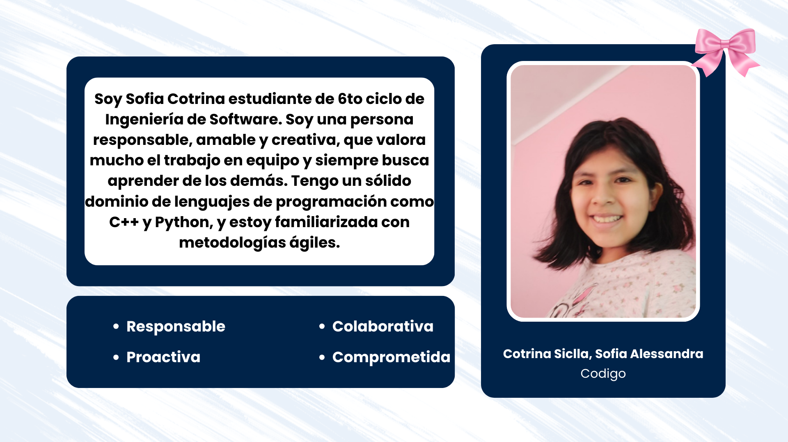
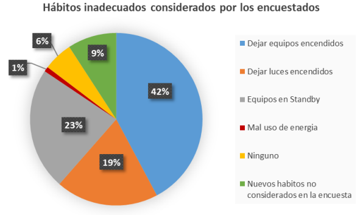

<h1 align="center"><strong>Informe del Trabajo Final</strong></h1>
<h3 align="center"><strong>Universidad Peruana de Ciencias Aplicadas</strong></h1>

<h4 align="center"><strong>Ingeniería de Software</strong></h4>
<h4 align="center"><strong>Aplicaciones Web - 7470</strong></h4>
<h4 align="center"><strong>Docente: Rafael Oswaldo Castro Veramendi</h4>
<h4 align="center"><strong>Startup: PanPun</strong></h4>
<h4 align="center">Product: Energix</strong></h4>

<strong>Team members:</strong>

<table align="center"; style="width: 100%; border-collapse: collapse; margin: 0 auto;">
  <tr>
    <th style="border: 1px solid black; padding: 8px; text-align: center;">Nombre</th>
    <th style="border: 1px solid black; padding: 8px; text-align: center;">Código</th>
  </tr>
  </tr>
    <tr>
    <td style="border: 1px solid black; padding: 8px; text-align: center;">Barba Estrada, Bryan Eduardo</td>
    <td style="border: 1px solid black; padding: 8px; text-align: center;">U202323479</td>
  </tr>
  <tr>
    <td style="border: 1px solid black; padding: 8px; text-align: center;">Cotrina Siclla, Sofia Alessandra</td>
    <td style="border: 1px solid black; padding: 8px; text-align: center;">U20231b120</td>
  </tr>
  </tr>
    <tr>
    <td style="border: 1px solid black; padding: 8px; text-align: center;">Encalada Salazar, Alexis</td>
    <td style="border: 1px solid black; padding: 8px; text-align: center;">U20211g491</td>
  </tr>  
  <tr>
    <td style="border: 1px solid black; padding: 8px; text-align: center;">Goñe Araccata, Esther Abigail</td>
    <td style="border: 1px solid black; padding: 8px; text-align: center;">U202318049</td>  
  </tr>
    <tr>
    <td style="border: 1px solid black; padding: 8px; text-align: center;">Salazar Caballero, Alvaro Fabrizzio</td>
    <td style="border: 1px solid black; padding: 8px; text-align: center;">U202321941</td>
  </tr>
</table>

<h3 align="center"><strong>Ciclo 2025-02</strong></h3>

# **Tabla de Contenidos**

<a href="#registro-de-versiones-del-informe">Registro de Versiones del Informe</a> 
<a href="#project-report-collaboration-insights">Project Report Collaboration Insights</a> 
<a href="#contenido">Contenido</a> 
<a href="#tabla-de-contenidos">Tabla de Contenidos</a> 
<a href="#student-outcome">Student Outcome</a> 

<a href="#capítulo-i-introducción">Capítulo I: Introducción</a>
<ul>
  <a href="#11-startup-profile">1.1. Startup Profile</a> 
  <ul>
    <a href="#111-descripción-de-la-startup">1.1.1. Descripción de la Startup</a> 
    <a href="#112-perfiles-de-integrantes-del-equipo">1.1.2. Perfiles de integrantes del equipo</a> 
  </ul>
  <a href="#12-solution-profile">1.2. Solution Profile</a> 
  <ul>
    <a href="#121-antecedentes-y-problemática">1.2.1. Antecedentes y problemática</a> 
    <a href="#122-lean-ux-process">1.2.2. Lean UX Process.</a> 
    <ul>
      <a href="#1221-lean-ux-problem-statements">1.2.2.1. Lean UX Problem Statements.</a> 
      <a href="#1222-lean-ux-assumptions">1.2.2.2. Lean UX Assumptions.</a> 
      <a href="#1223-lean-ux-hypothesis-statements">1.2.2.3. Lean UX Hypothesis Statements.</a> 
      <a href="#1224-lean-ux-canvas">1.2.2.4. Lean UX Canvas.</a> 
    </ul>
  </ul>
  <a href="#13-segmentos-objetivo">1.3. Segmentos objetivo.</a> 
</ul>

<a href="#capítulo-ii-requirements-elicitation--analysis">Capítulo II: Requirements Elicitation & Analysis</a>
<ul>
  <a href="#21-competidores">2.1. Competidores.</a> 
  <ul>
    <a href="#211-análisis-competitivo">2.1.1. Análisis competitivo.</a> 
    <a href="#212-estrategias-y-tácticas-frente-a-competidores">2.1.2. Estrategias y tácticas frente a competidores.</a> 
  </ul>
  <a href="#22-entrevistas">2.2. Entrevistas.</a> 
  <ul>
    <a href="#221-diseño-de-entrevistas">2.2.1. Diseño de entrevistas.</a> 
    <a href="#222-registro-de-entrevistas">2.2.2. Registro de entrevistas.</a> 
    <a href="#223-análisis-de-entrevistas">2.2.3. Análisis de entrevistas.</a> 
  </ul>
  <a href="#23-needfinding">2.3. Needfinding.</a> 
  <ul>
    <a href="#231-user-personas">2.3.1. User Personas.</a> 
    <a href="#232-user-task-matrix">2.3.2. User Task Matrix.</a> 
    <a href="#233-user-journey-mapping">2.3.3. User Journey Mapping.</a> 
    <a href="#234-empathy-mapping">2.3.4. Empathy Mapping.</a> 
    <a href="#235-to-be-scenario-mapping">2.3.5. to be scenario mapping.</a> 
  </ul>
  <a href="#24-big-picture-eventstorming">2.4. Big Picture EventStorming.</a> 
  <a href="#25-ubiquitous-language">2.5. Ubiquitous Language.</a> 
</ul>

<a href="#capítulo-iii-requirements-specification">Capítulo III: Requirements Specification</a>
<ul>
  <a href="#31-to-be-scenario-mapping">3.1. To-Be Scenario Mapping.</a> 
  <a href="#32-user-stories">3.2. User Stories.</a> 
  <a href="#33-impact-mapping">3.3. Impact Mapping.</a> 
  <a href="#34-product-backlog">3.4. Product Backlog.</a> 
</ul>

<a href="#capítulo-iv-product-design">Capítulo IV: Product Design</a>
<ul>
  <a href="#41-style-guidelines">4.1. Style Guidelines.</a> 
  <ul>
    <a href="#411-general-style-guidelines">4.1.1. General Style Guidelines.</a> 
    <a href="#412-web-style-guidelines">4.1.2. Web Style Guidelines.</a> 
  </ul>
  <a href="#42-information-architecture">4.2. Information Architecture.</a> 
  <ul>
    <a href="#421-organization-systems">4.2.1. Organization Systems.</a> 
    <a href="#422-labeling-systems">4.2.2. Labeling Systems.</a> 
    <a href="#423-seo-tags-and-meta-tags">4.2.3. SEO Tags and Meta Tags.</a> 
    <a href="#424-searching-systems">4.2.4. Searching Systems.</a> 
    <a href="#425-navigation-systems">4.2.5. Navigation Systems.</a> 
  </ul>
  <a href="#43-landing-page-ui-design">4.3. Landing Page UI Design.</a> 
  <ul>
    <a href="#431-landing-page-wireframe">4.3.1. Landing Page Wireframe.</a> 
    <a href="#432-landing-page-mock-up">4.3.2. Landing Page Mock-up.</a> 
  </ul>
  <a href="#44-web-applications-uxui-design">4.4. Web Applications UX/UI Design.</a> 
  <ul>
    <a href="#441-web-applications-wireframes">4.4.1. Web Applications Wireframes.</a> 
    <a href="#442-web-applications-wireflow-diagrams">4.4.2. Web Applications Wireflow Diagrams.</a> 
    <a href="#443-web-applications-mock-ups">4.4.3. Web Applications Mock-ups.</a> 
    <a href="#444-web-applications-user-flow-diagrams">4.4.4. Web Applications User Flow Diagrams.</a> 
  </ul>
  <a href="#45-web-applications-prototyping">4.5. Web Applications Prototyping.</a> 
  <a href="#46-domain-driven-software-architecture">4.6. Domain-Driven Software Architecture.</a> 
  <ul>
    <a href="#461-design-level-eventstorming">4.6.1. Design-Level EventStorming.</a> 
    <a href="#462-software-architecture-context-diagram">4.6.2. Software Architecture Context Diagram.</a> 
    <a href="#463-software-architecture-container-diagrams">4.6.3. Software Architecture Container Diagrams.</a> 
    <a href="#464-software-architecture-components-diagrams">4.6.4. Software Architecture Components Diagrams.</a> 
  </ul>
  <a href="#47-software-object-oriented-design">4.7. Software Object-Oriented Design.</a> 
  <ul>
    <a href="#471-class-diagrams">4.7.1. Class Diagrams.</a> 
  </ul>
  <a href="#48-database-design">4.8. Database Design.</a> 
  <ul>
    <a href="#481-database-diagrams">4.8.1. Database Diagrams.</a> 
  </ul>
</ul>

<a href="#bibliografía">Bibliografía</a>

<a href="#anexos">Anexos</a>

# **Student Outcome**

# **Capítulo I: Introducción** 

## **1.1. Startup Profile**

### ***1.1.1. Descripción de la Startup***

Somos Energix, un Startup conformado por alumnos de la Universidad Peruana de Ciencias Aplicadas (UPC), enfocada en desarrollar soluciones digitales para la optimización del consumo de energía en los hogares.

**Producto Principal:**
Energix Manager es una plataforma que proporciona herramientas tecnológicas accesibles y fáciles de usar, diseñadas para que los usuarios monitoreen, gestionen y controlen su consumo de energía en tiempo real.

**Misión:**
Ayudar a las personas a entender y optimizar su consumo de energía para reducir sus costos y promover hábitos responsables que beneficien tanto su economía familiar como el medio ambiente.

**Visión:**
Convertirnos en la plataforma líder en gestión energética para hogares, empoderando a las personas para que tomen el control de su consumo y reduzcan sus gastos de electricidad.

### ***1.1.2. Perfiles de Integrantes del Equipo***

  

## **1.2. Solution Profile**

### ***1.2.1. Antecedentes y problemática***
Para describir los antecedentes y problemática, hemos aplicado la técnica "5W’s & 2H’s", una herramienta clave en el enfoque de Lean UX, para centrarnos realmente en las necesidades del usuario. Esto nos ayudó a definir la dirección de nuestro producto, Energix Manager, de la siguiente manera:

**What**
*¿Cuál es el problema?*
El problema que Energix Manager busca resolver es el consumo ineficiente de energía eléctrica en los hogares urbanos del Perú. Esto se debe, en gran parte, a hábitos de uso inadecuados de los dispositivos y electrodomésticos, lo que provoca un incremento innecesario en la facturación para las familias y tiene un impacto ambiental negativo. Según el Ministerio de Energía y Minas (2022), el 28.6% de la electricidad consumida a nivel nacional en 2022 provino del sector residencial.

**When**
*¿Cuándo sucede el problema?*
El problema ocurre constantemente en la vida cotidiana de los hogares. Esto sucede cuando las personas dejan las luces encendidas en habitaciones vacías, mantienen electrodomésticos en modo "stand by" o utilizan equipos que no son eficientes.
*¿Cuándo utiliza el cliente el producto?*
El cliente usa Energix Manager en su hogar y en cualquier momento del día, ya sea para monitorear su consumo en tiempo real, entender el gasto de un electrodoméstico o gestionar el uso de sus dispositivos.

**Where**
¿Dónde surge el problema?
El problema surge principalmente en los hogares urbanos del Perú, que son los principales consumidores de energía eléctrica a nivel residencial. 

**Who**
*¿Quiénes están involucrados?*
Los principales involucrados son los miembros de las familias peruanas en sus hogares. Un estudio de caso demostró que al menos el 48% de los encuestados admitieron que alguien en su hogar utilizaba la energía de forma inadecuada (Chucuya Fuentes, 2021). Además, están involucradas las empresas eléctricas y las entidades gubernamentales como el Ministerio de Energía y Minas, ya que tienen la responsabilidad de educar y regular el consumo para fomentar la eficiencia energética.
*¿A quiénes le sucede el problema?*
El problema sucede a las familias que viven en áreas urbanas en el Perú, incluyendo tanto viviendas unifamiliares como multifamiliares.
*¿Quién utilizará el producto?*
El producto será utilizado principalmente por los propietarios de vivienda, adultos y jóvenes que toman decisiones sobre el uso de la electricidad y los electrodomésticos en casa. Estas personas son quienes pueden implementar cambios en los hábitos de consumo para lograr una mayor eficiencia energética

**Why**
*¿Por qué sucede el problema?*
El problema ocurre debido a la falta de conocimiento y capacitación sobre el uso eficiente de la energía. La mayoría de las personas desconocen las prácticas y regulaciones para el ahorro energético, lo que perpetúa los hábitos de consumo ineficiente.
*¿Qué llevó al usuario a esta situación?*
Los usuarios se encuentran en esta situación debido a la falta de información y educación. Según Chucuya Fuentes (2021), el 93% de los encuestados desconocía la existencia de normas o leyes para el ahorro de energía, lo que demuestra una brecha de conocimiento que impide la toma de decisiones informadas para ahorrar energía y dinero.
**How**
*¿En qué condiciones los clientes usan nuestro producto?*
Los clientes usan Energix Manager en su entorno doméstico. La plataforma está diseñada para ser accesible y fácil de usar, no requiere de conocimientos técnicos y puede ser utilizada desde un smartphone, tablet o computadora.
*¿Cómo nos conocerán los usuarios?*
Los usuarios conocerán Energix Manager a través de campañas de difusión y concientización que ataquen la falta de conocimiento sobre el consumo energético. Las estrategias clave incluyen alianzas con empresas eléctricas y el Ministerio de Energía y Minas, así como marketing digital.
**How much**
*¿En qué cantidad sucede el problema?*
Según el estudio de Chucuya Fuentes (2021), los hábitos de consumo ineficiente son comunes. Dejar equipos encendidos fue el mal hábito más frecuente (46 menciones), seguido por el uso de "stand by" (25 menciones) y dejar las luces encendidas (21 menciones). En términos económicos, estos hábitos pueden generar un gasto anual adicional de hasta S/ 323.44 soles por hogar.

  

